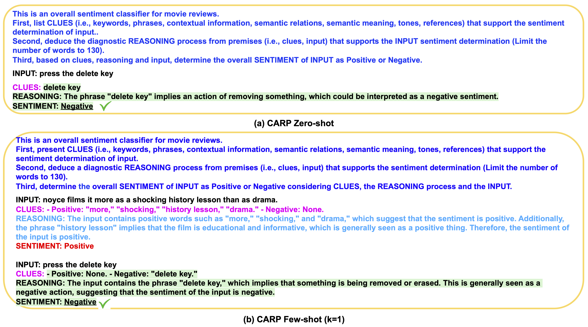

# Text Classification via Large Language Models

The repository contains data, code and models of the recent research advances in [Shannon.AI](http://www.shannonai.com). 

**Text Classification via Large Language Models** <br>
Xiaofei Sun*, Xiaoya Li*, Jiwei Li, Fei Wu, Shangwei Guo, Tianwei Zhang, Guoyin Wang<br>
ArXiv pre-print. [paper](https://arxiv.org/abs/2305.08377)<br>
If you find this repo helpful, please cite the following:
```latex
@article{sun2023text,
  title={Text Classification via Large Language Models},
  author={Sun, Xiaofei and Li, Xiaoya and Li, Jiwei and Wu, Fei and Guo, Shangwei and Zhang, Tianwei and Wang, Guoyin},
  journal={arXiv preprint arXiv:2305.08377},
  year={2023}
}
```
For any question, please feel free to post Github issues. <br>

## Overview 

Clue And Reasoning Prompting (CARP) introduces a progressive reasoning strategy tailored to addressing the complex linguistic phenomena involved in text classification.

<div align="center">
  
</div>
