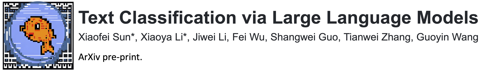
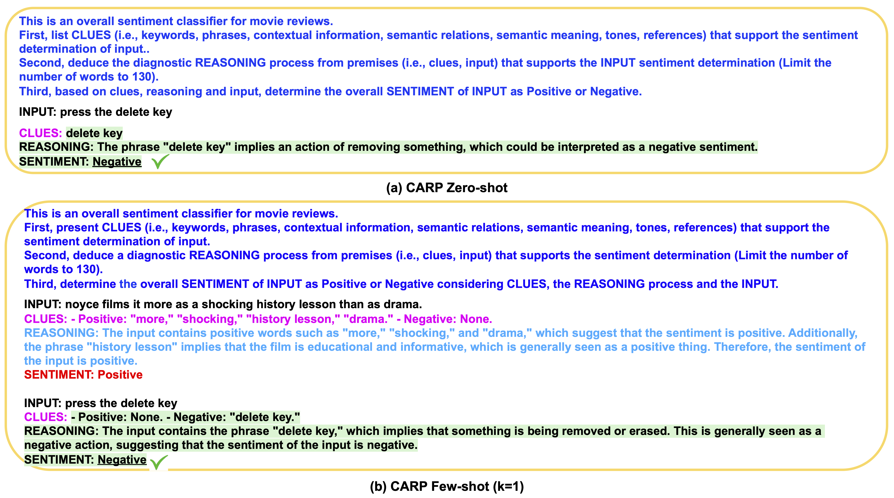

<div align="center">
  
</div>

[Paper Link](https://arxiv.org/abs/2305.08377)<br>

If you find this repo helpful, please cite the following:
```latex
@article{sun2023text,
  title={Text Classification via Large Language Models},
  author={Sun, Xiaofei and Li, Xiaoya and Li, Jiwei and Wu, Fei and Guo, Shangwei and Zhang, Tianwei and Wang, Guoyin},
  journal={arXiv preprint arXiv:2305.08377},
  year={2023}
}
```
For any question, please feel free to post Github issues. <br>


## Overview 

In this paper, we introduce Clue And Reasoning Prompting (CARP), which is a progressive reasoning strategy tailored to addressing the complex linguistic phenomena involved in text classification.
CARP first prompts LLMs to find superficial clues (e.g., keywords, tones, semantic relations, references, etc), based on which a diagnostic reasoning process is deduced for final decisions. 
To further address the limited token issue, CARP uses a fine-tuned model on the supervised dataset for kNN demonstration search in the in-context learning, allowing the model to take the advantage of both LLM’s generalization ability and the task-specific evidence provided by the full labeled dataset. <br>
 
Examples of prompts under zero-shot and few-shot (k=1) settings are shown in the following: <br>

<div align="left">
  
</div>


### Data 

### Setup Environment

Before running this project, you need to create a conda environment and install required packages. <br>

```bash 
conda create -n gpt-env python=3.7
conda activate gpt-env
pip install torch==1.8.1+cu111  torchvision==0.9.1+cu111 -f https://download.pytorch.org/whl/torch_stable.html
cd GPT-CLS-CARP
pip install -r requirements.txt -i https://mirrors.aliyun.com/pypi/simple/
```

After that, please execute the following commands in the terminal for downloading NLTK's dependent files.

```bash 
$ conda activate gpt-env
$ python3 
>>> import nltk
>>> nltk.download('punkt')
```

### Baseline: Supervised RoBERTa

We release code and scripts for fine-tuning RoBERTa-Large on five text classification datasets, including [SST-2](), [AgNews](), [R8](), [R52](), and [MR]().

### Zero-shot  

The main procedure is in `task/gpt3_text_cls.py`
Scripts for reproducing our experimental results can be found in the `./scripts/<dataset_name>/gpt3_zeroshot/` folder. 
Note that you need to change `DATA_DIR`, `OUTPUT_DIR` to your own dataset path, bert model path and log path, respectively.
For example, run `./scripts/sst2/gpt3_zeroshot/carp_davinci003.sh` will start 
prompt gpt-3 in the zero-shot setting and save intermediate log to `$OUTPUT_DIR`.

### Few-shot 

The main procedure is in `task/gpt3_text_cls.py`
Scripts for reproducing our experimental results can be found in the `./scripts/<dataset_name>/<retriever_type>/gpt3_fewshot/` folder. 
Note that you need to change `DATA_DIR`, `OUTPUT_DIR` to your own dataset path, bert model path and log path, respectively.
For example, run `./scripts/sst2/gpt3_fewshot/carp_davinci003.sh` will start 
prompt gpt-3 in the zero-shot setting and save intermediate log to `$OUTPUT_DIR`.